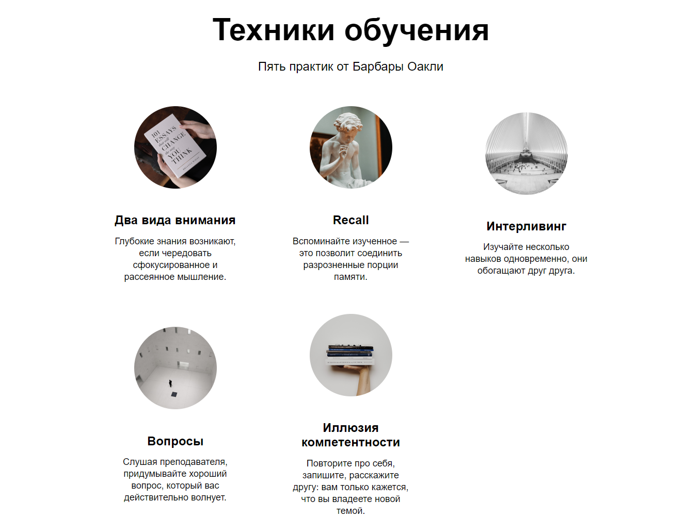
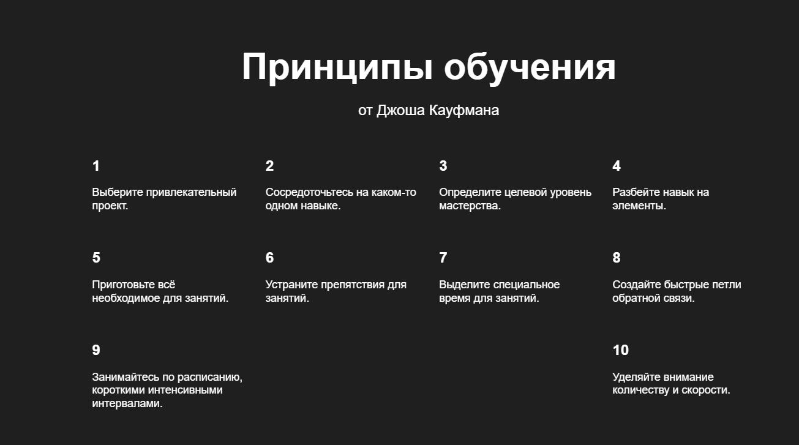
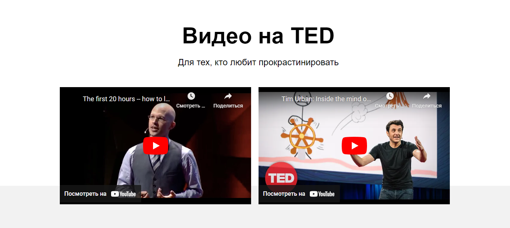

<h1 align="center">"How-to-learn" one page project in Yandex.Practicum by Vladimir Fedorchuk</h1>

## [Check out the project on GitHubPages](https://freddymutant.github.io/how-to-learn/)

## Description

One page site about study tips and methologies.

# Examples

The project aims to facilitate the learning process. It includes links to helpful books, resources, and YouTube videos. Contains tables with techniques to help you approach learning more effectively.

## Functionality

- organazing file structure according to BEM-methodology (Nested method),
- flexbox-layouting, positioning elements,
- working with embedded Youtube videos,
- animating and transforming page elements with CSS

This is my first project in **Yandex.Practicum**.

## Technologies used

- HTML;
- Import style rules from stylesheets.
- Simple CSS animations (keyframes);
- Youtube API;
- Git
